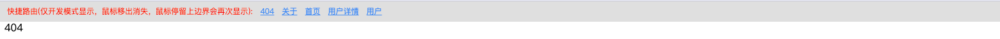

---

# react-router-decorator

Custom route with class decorator or function, automatic sorting and support nested routes. Based on `react-router-dom`.

基于 `react-router-dom` 封装，使用类装饰器或函数配置路由，自动排序，支持嵌套路由。

## Install

```
$ npm install --save react-router-decorator
```

or

```
$ yarn add react-router-decorator
```

or

```
$ pnpm add react-router-decorator
```

## Use `class decorator` ([TC39 Proposal](https://github.com/tc39/proposal-decorators))

### Config `tsconfig.json` to support `decorator`.

```json
{
  "compilerOptions": {
    "experimentalDecorators": true,
    "emitDecoratorMetadata": true
  }
}
```

### Config `Babel`(webpack) to support JavaScript/Typescript compiling.

```json
{
  "plugins": [
    ["@babel/plugin-proposal-decorators", { "version": "2023-05" }],
    "@babel/plugin-proposal-class-properties"
  ]
}
```

or

```json
{
  "presets": ["@babel/preset-env"],
  "plugins": [["@babel/plugin-proposal-decorators", { "version": "2023-05" }]]
}
```

### Config `vite.config.ts` to support vite.

```ts
import react from '@vitejs/plugin-react';
import { defineConfig } from 'vite';

// https://vitejs.dev/config/
export default defineConfig({
  plugins: [
    react({
      babel: {
        parserOpts: {
          plugins: ['decorators-legacy'],
        },
      },
    }),
  ],
});
```

## type.d.ts

```ts
import React from 'react';
import { NavigateFunction, RouteObject } from 'react-router-dom';

/**
 * 组件上可设置属性用于开启或关闭 `withPageWrapper` `childrenAsOutlet` 优先级最高
 */
export interface Extra {
  withPageWrapper?: boolean;
  childrenAsOutlet?: boolean;
}

/**
 * 支持的其他的 RouteObject
 */
export type PickRouteObject = Omit<RouteObject, 'Component' | 'path' | 'children'>;

/**
 * 页面级组件
 */
export type PageComponent = React.ComponentType<any> & Extra;

/**
 * 解析 url search 参数
 */
export type Query = {
  readonly [key: string]: undefined | string | string[] | Query | Query[];
};

/**
 * 路由参数
 */
export type Params = {
  readonly [key: string]: string | undefined;
};

/**
 * 注册页面路由时额外的参数
 */
export interface PageDefine {
  title?: string | ((params: Params, query: Query) => string);
  context?: string;
  lazy?: boolean;
}

/**
 * 被默认 PageWrapper 包裹的页面自动解析的参数
 */
export interface WithWrappedProps {
  query: Query;
  params: Params;
  navigate: NavigateFunction;
  path: string;
  children?: React.ReactNode;
}

export interface PageWrapperProps extends PageDefine {
  path: string;
  Component: PageComponent;
  childrenAsOutlet?: boolean;
}

export type PageWrapperType = React.ComponentType<PageWrapperProps>;

export type RouteOption = Omit<PageWrapperProps, 'childrenAsOutlet'> & PickRouteObject;

export type PageOptions = (PageDefine & PickRouteObject) | string;

export interface RenderOptions {
  /**
   * 路由类型
   */
  type?: 'hash' | 'history';
  /**
   * App Wrapper
   */
  Wrapper?: React.ComponentType<any>;
  /**
   * 使用默认 Page Wrapper
   */
  withPageWrapper?: boolean;
  /**
   * 自定义 Page Wrapper
   */
  PageWrapper?: PageWrapperType;
  /**
   * 使用 children 代替 Outlet
   */
  childrenAsOutlet?: boolean;
  /**
   * 开启调试模式，控制台输出路由信息
   */
  debug?: boolean;
  /**
   * 开启路由辅助工具
   */
  helper?: boolean;
}
```

## API

### renderApp(element: HTMLElement, options?: RenderOptions)

instead of `ReactDOM.render(<App/>, element)`.

#### element

Type: `HTMLElement`, the `ReactDOM.render` root element.

#### options

Type: `RenderOptions`

---

### page(path: string | '/' | '\*', options?: PageOptions)

use class decorator to register route.

#### path

Type: `string` , `"/"` or `"*"`

#### options

Type: `PageOptions`, if `typeof PageOptions` is `string` it's mean `document title`.

---

### $page(Component: PageComponent, path: string | '/' | '\*', options?: PageOptions)

use function to register route.

#### Component

Type: `PageComponent`

#### path

Type: `string` , `"/"` or `"*"`

#### options

## Type: `PageOptions`, if `typeof PageOptions` is `string` it's mean `document title`.

---

## Usage

### Use `page`, `$page`, `renderApp`

```tsx
import React from 'react';
import { page, $page, Outlet, NavLink, renderApp } from 'react-router-decorator';

// 主路由
@page('/')
class PageIndex extends React.Component {
  render () {
    return <div>首页</div>
  }
}

// 父路由
@page('/user', { title: '用户页面' })
class PageUser extends React.Component {
  render () {
    return <>
      <div>User</div>
      <Outlet/>
    </>
  }
}
// 嵌套路由指定 context
@page('/:id', { title: '用户详情', context: '/user' })
class PageUserInfo extends React.Component {
  render () {
    return <div>user info</div>
  }
}

// 同一个组件多个路由（类似有权限控制的场景）
@page('/normal/management', { title: '普通' })
@page('/management', { title: '高级' })
class PageManagement extends React.Component {
  render () {
    return <div>Management</div>
  }
}

// 404路由
@page('*', { title: '404页面' })
class Page404 extends React.Component {
  render () {
    return <div
      <div>404</div>
      <NavLink to='/'>返回首页</NavLink>
    </div>
  }
}

const FuncComponent = () => {
  return <div>函数组件</div>
};

// 注册函数组件
$page(FuncComponent, '/fun1');
$page(FuncComponent, '/fun2');

// 入口等价于 ReactDOM.render
renderApp(document.getElementById('app'));
```

---

### Custom render

```tsx
import React from 'react';
import { createRoot } from 'react-dom/client';
import { AppRouter, AppRoutes, MemoryRouter } from 'react-router-decorator';

// render AppRouter
createRoot(document.getElementById('app')).render(<AppRouter type={'hash'} />);

// render AppRoutes
createRoot(document.getElementById('app')).render(
  <MemoryRouter>
    <AppRoutes />
  </MemoryRouter>,
);
```

---

### withPageWrapper

- PageWrapper

```tsx
const CustomPageWrapper: PageWrapperType = (props: PageWrapperProps) => {
  const { Component, ...others } = props;
  // do something
  return <Component />;
};
```

- `withPageWrapper: false`

```tsx
import React from 'react';

const Component = () => {
  const params = useParams();
  const id = params.id;
  return <>{id}</>;
};

$page(Component, '/test/:id');
```

- `withPageWrapper: true`

```tsx
import React from 'react';

const Component = ({ params, query }) => {
  // 内置 PageWrapper 提供的能力
  const id = params.id;
  return <>{id}</>;
};

$page(Component, '/test/:id');
```

---

### childrenAsOutlet (`{ children } instead of <Outlet/>`)

- `childrenAsOutlet: false`

```tsx
@page('/user', { title: '用户页面' })
class PageUser extends React.Component {
  render() {
    return (
      <>
        <div>User</div>
        <Outlet />
      </>
    );
  }
}

// 嵌套路由指定 context
@page('/:id', { title: '用户详情', context: '/user' })
class PageUserInfo extends React.Component {
  render() {
    return <div>user info</div>;
  }
}
```

- `childrenAsOutlet: true`

```tsx
@page('/user', { title: '用户页面' })
class PageUser extends React.Component {
  render() {
    return (
      <>
        <div>User</div>
        {this.props.children}
      </>
    );
  }
}

// 嵌套路由指定 context
@page('/:id', { title: '用户详情', context: '/user' })
class PageUserInfo extends React.Component {
  render() {
    return <div>user info</div>;
  }
}
```

---

### [lazy](https://github.com/yantaolu/react-router-decorator/tree/main/examples/lazy) (since 0.2.0)

```tsx
import { lazy } from 'react';
import { $page, renderApp } from 'react-router-decorator';

const LazyComponent = lazy(() => import('./pages/lazy'));

$page(LazyComponent, '/lazy', { lazy: true });

renderApp(document.getElementById('app'));
```

---

## DevRouterHelper (since 1.0.2)



```typescript jsx
import { AppRouter, DevRouterHelper, PageWrapper } from 'react-router-decorator';

const CustomPageWrapper: FC<PageWrapperProps> = (props) => {
  return (
    <>
      {/* 这里可以写页面公共的代码，如导航头部 */}
      {process.env.NODE_ENV === 'development' && <DevRouterHelper />}
      <PageWrapper {...props} />
    </>
  );
};

const App = () => {
  return (
    <>
      {/* 这里可以增加app级别的代码，如使用antd ConfigProvider 包裹 */}
      <AppRouter PageWrapper={CustomPageWrapper} debug={process.env.NODE_ENV === 'development'} />
    </>
  );
};
```

---

## DataRouter (since 1.0.7)

Support the Data APIs.

```typescript jsx
import { DataRouter, useNavigation, $page } from 'react-router-decorator';

const Home = () => {
  const navigation = useNavigation();
};

$page(Home, '/');

const App = () => {
  return (
    <>
      {/* 这里可以增加app级别的代码，如使用antd ConfigProvider 包裹 */}
      <DataRouter debug={process.env.NODE_ENV === 'development'} helper />
    </>
  );
};
```
